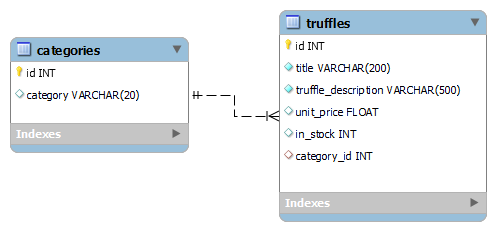
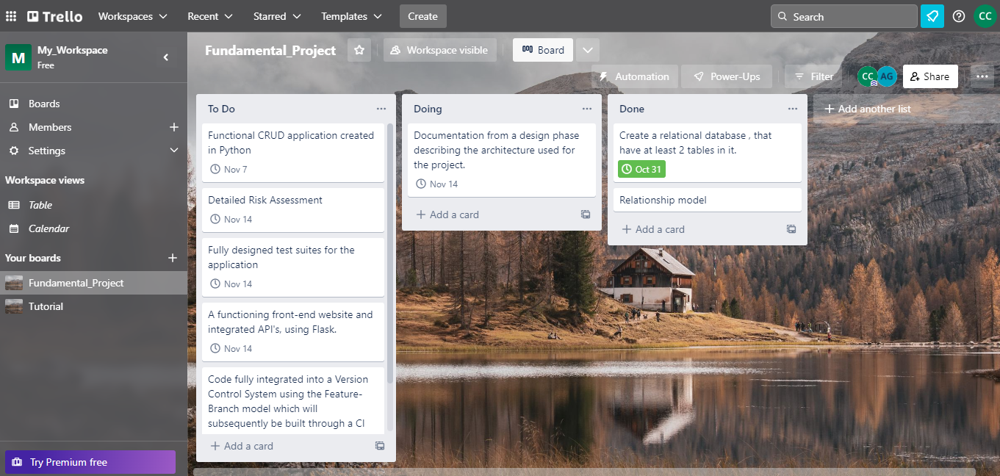
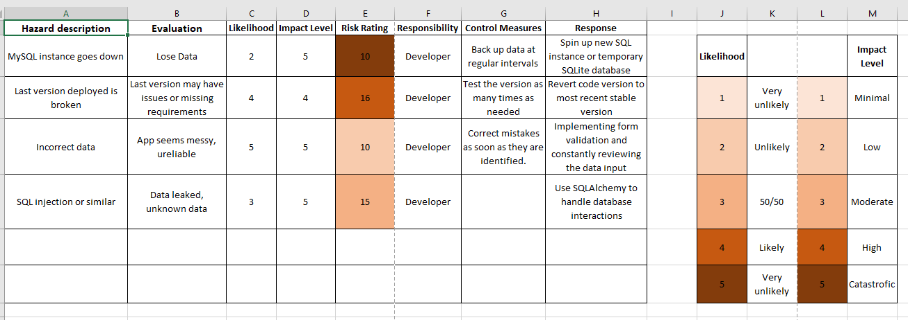
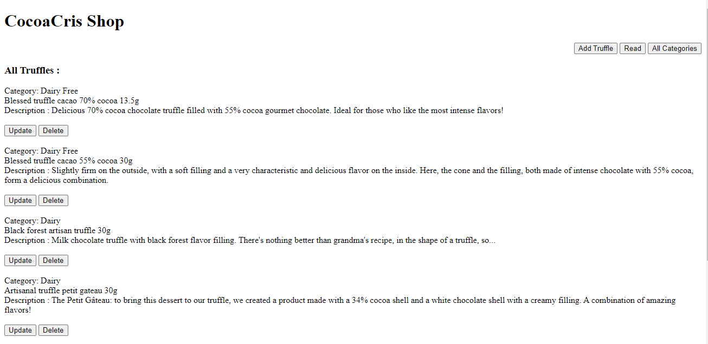
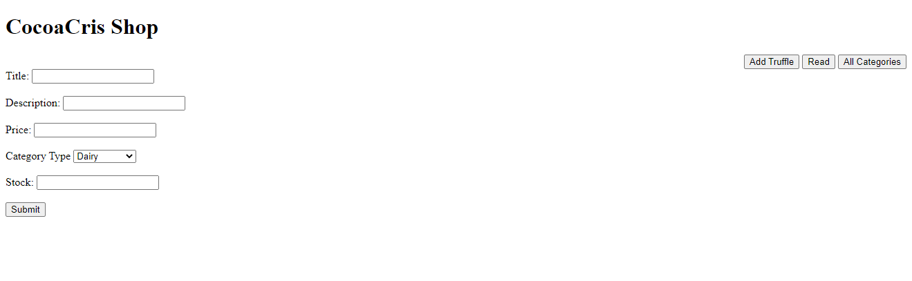
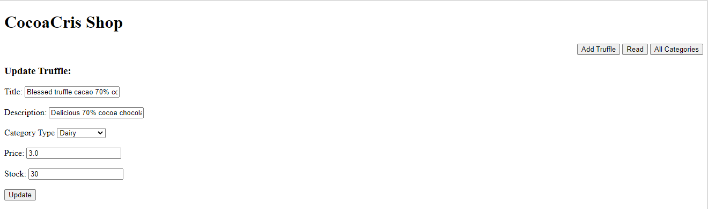
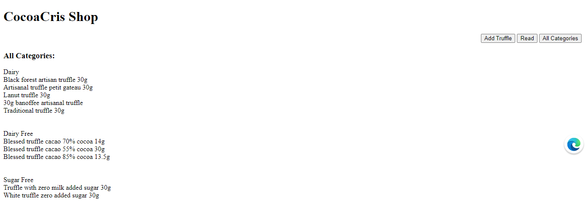

QA Fundamental Project
===================

This project was designed to comply with the specifications of the Fundamental Project. 

## Objective

The overall objective with this project is:

- To create a CRUD (<em>create, read, update and delete</em>) application 
- Assess my capabilities with the technologies and concepts learned 
- Assess my development against SFIA (<em>skills framework for the information age</em>)

## Scope ##

The requirements of the project are as follows:

- A Trello board (or equivalent Kanban board tech) with full expansion
on user stories, use cases and tasks needed to complete the project.
It could also provide a record of any issues or risks that you faced
creating your project.
- A relational database used to store data persistently for the
project, this database needs to have at least 2 tables in it, to
demonstrate your understanding, you are also required to model a
relationship.
- Clear Documentation from a design phase describing the architecture
you will use for you project as well as a detailed Risk Assessment.
- A functional CRUD application created in Python, following best
practices and design principles, that meets the requirements set on
your Kanban Board
- Fully designed test suites for the application you are creating, as
well as automated tests for validation of the application. You must
provide high test coverage in your backend and provide consistent
reports and evidence to support a TDD approach.
- A functioning front-end website and integrated API's, using Flask.
- Code fully integrated into a Version Control System using the
Feature-Branch model which will subsequently be built through a CI
server and deployed to a cloud-based virtual machine.

## Constraints 

- The application needs to be CRUD functional, however as part of your
training you will create a CRUD functional Flask Blog complete with
Registration and Login Functionality.
- When creating the entities for your project, you must create at least
2 tables that share a relationship. You must create 2 different
entities with a different relationship.
- The application needs to utilise the technology discussed during
the training modules. The tech stack required would be the following:
  * Kanban Board: Trello or an equivalent Kanban Board
  * Database: GCP SQL Server or other Cloud Hosted managed Database.
  * Programming language: Python
  * Unit Testing with Python (Pytest)
  * Integration Testing with Python (Selenium)
  * Front-end: Flask (HTML)
  * Version Control: Git
  * CI Server: Jenkins
  * Cloud server: GCP Compute Engine
--------------------------------------

  ## App Design
  I decided to build an App to add truffles from different categories, which allows you to update and delete truffles and see the list in which each truffle belongs to. 
  The database for this project comprises a Truffles table and a Categories table having a one-to-many relationship, where one Category can have many truffles and one truffle belongs to only one category. The ERD(entity–relationship model) for this MVP(Minimum Viable Product) is shown below: 

## CI Pipeline:

 The Trello board I was used to track the project. A list of items were assigned to a <em>To Do</em> list, moving to a <em>Doing</em> lits and then to the <em>Done</em> list as the tasks were completed. 
 The state of the Trello board at the beggining was:

  

The trello board can be accessed [here](https://trello.com/b/ESbyu6vy/fundamentalproject) 

## Version Control

The code was fully integrated into the SCM (source control management), Git and hosted in the repository hosting services GitHub, in order to tracking and managing changes to the code. Git provides the ability to store code in a central repository away from the development environment, track changes over time and create branches for additions to be made in isolation from stable code. 

## Risk Assessment 

A risk assessment was designed to evaluate potential scenarios that may impact the project in a negative way. These measures could then be implemented in the app such that these risks are less likely to occur. This initial risk assessment is shown below:

Some of the control measures implemented in the project to reduce the likelihood of a risk occurring are as follows:
- Back up of the data regularly from SQL Alchemy into csv file
- Implemented WTF form validation to avoid the input of incorrect
- SQLAlchemy was used with Flask to prevent SQL commands being sent directly to the database

## Testing
Testing is a crucial part of software development. 
To test this flask application a unit test was implemented to test the functionality for create, read, update and delete, to ensure that these worked as intended.

## The App

Once the app is running, the user is presented with the main page: 

The top right hand side of the page provides links that allow to add a truffle and see all categories. To add a new truffle, you click on the <em>Add Truffle</em> button. After filling out the form, the user is redirect to the main page. 

The application allows you to update and delete truffles. 

Finally, you can see all the truffle categories on the categories page.

