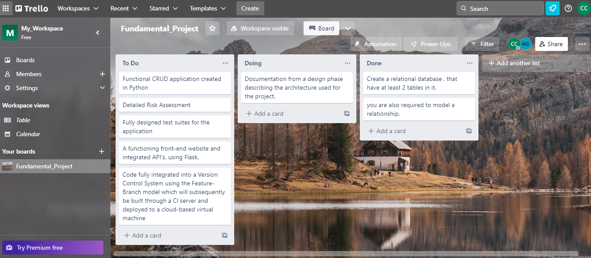
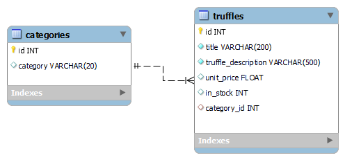

CocoaCris Shop
===================

This project was designed to comply with the specifications of the Fundamental Project. 

## Objective

The overall objective with this project is:

- To create a CRUD (<em>create, read, update and delete</em>) application 
- Assess my capabilities with the technologies and concepts learned 
- Assess my development against SFIA (<em>skills framework for the information age</em>)

## Scope ##

The requirements of the project are as follows:

- A Trello board (or equivalent Kanban board tech) with full expansion
on user stories, use cases and tasks needed to complete the project.
It could also provide a record of any issues or risks that you faced
creating your project.
- A relational database used to store data persistently for the
project, this database needs to have at least 2 tables in it, to
demonstrate your understanding, you are also required to model a
relationship.
- Clear Documentation from a design phase describing the architecture
you will use for you project as well as a detailed Risk Assessment.
- A functional CRUD application created in Python, following best
practices and design principles, that meets the requirements set on
your Kanban Board
- Fully designed test suites for the application you are creating, as
well as automated tests for validation of the application. You must
provide high test coverage in your backend and provide consistent
reports and evidence to support a TDD approach.
- A functioning front-end website and integrated API's, using Flask.
- Code fully integrated into a Version Control System using the
Feature-Branch model which will subsequently be built through a CI
server and deployed to a cloud-based virtual machine.

## Constraints 

- Your application needs to be CRUD functional, however as part of your
training you will create a CRUD functional Flask Blog complete with
Registration and Login Functionality.
- When creating the entities for your project, you must create at least
2 tables that share a relationship. You must create 2 different
entities with a different relationship.
- The application needs to utilise the technology discussed during
the training modules. The tech stack required would be the following:
  * Kanban Board: Trello or an equivalent Kanban Board
  * Database: GCP SQL Server or other Cloud Hosted managed Database.
  * Programming language: Python
  * Unit Testing with Python (Pytest)
  * Integration Testing with Python (Selenium)
  * Front-end: Flask (HTML)
  * Version Control: Git
  * CI Server: Jenkins
  * Cloud server: GCP Compute Engine
--------------------------------------

  ## Approach
 1 - I started the project by creating a Trello board: 

  

2 - A relational database with and the relationship among the tables:

3 - Inserted a few records into the table: 